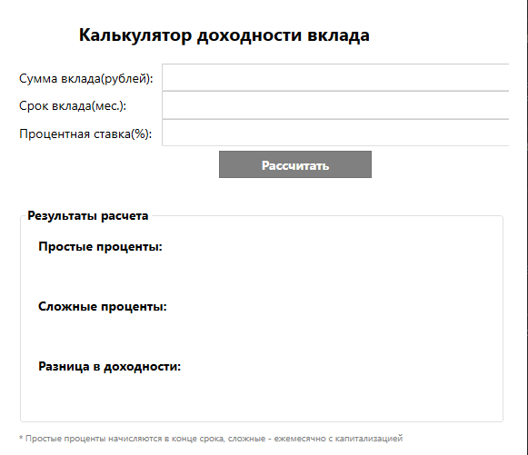

# Калькулятор вкладов (WPF)

## Описание проекта

**Калькулятор вкладов** — это десктопное приложение на платформе Windows Presentation Foundation (WPF), предназначенное для расчёта дохода по банковскому вкладу. Приложение позволяет сравнить два метода начисления процентов:

- **Простые проценты** — начисляются один раз в конце срока вклада на первоначальную сумму.
- **Сложные проценты** — начисляются ежемесячно с капитализацией (проценты прибавляются к основной сумме, и в следующем месяце проценты начисляются уже на увеличенную сумму).

## Назначение

Приложение разработано в рамках учебного задания для демонстрации:
- работы с финансовыми расчётами;
- реализации двух методов начисления процентов;
- создания графического интерфейса пользователя (GUI) на WPF;
- обработки пользовательского ввода и валидации данных.

## Формулы расчёта

### Простые проценты
Доход = Сумма × (Ставка / 100 / 12) × Количество месяцев

Начисляются один раз в конце срока вклада.

### Сложные проценты (с ежемесячной капитализацией)
Итоговая сумма = Сумма × (1 + Ставка / 100 / 12)^Количество месяцев
Доход = Итоговая сумма - Сумма

Каждый месяц проценты начисляются на текущую сумму вклада (включая ранее начисленные проценты).

## Визуальный вид

